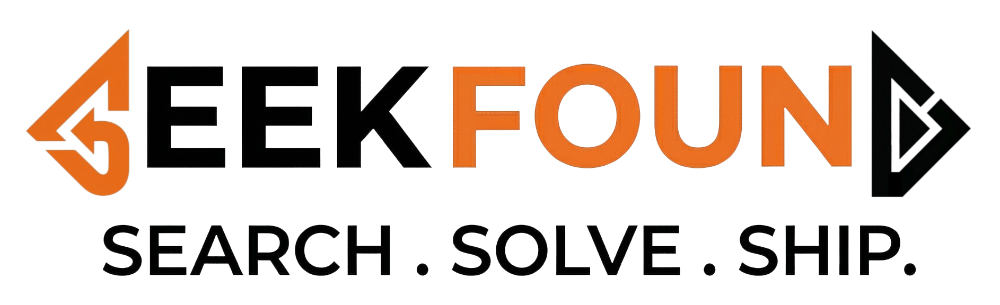
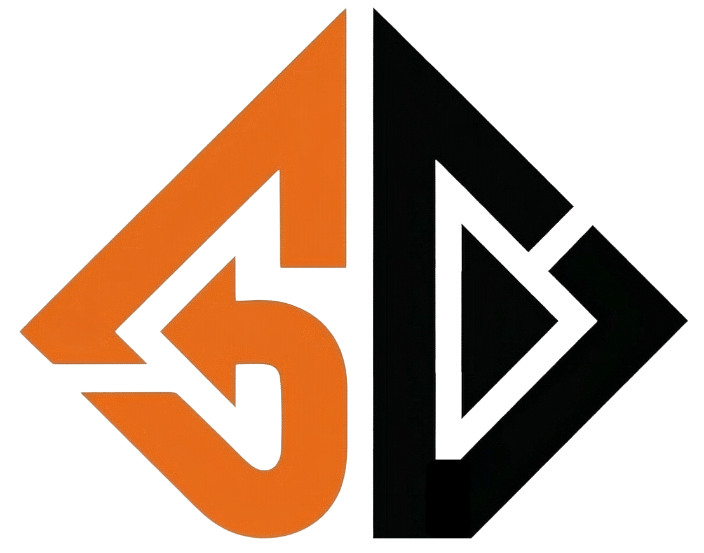

  
  

  <h4>SEARCH . SOLVE . SHIP .</h4>

  

    At SeekFound we build modern systems, infrastructure, and hardware solutions. From idea to production — fast, scalable, and reliable.
  

  

    <a href="https://seekfound.dev">🌐 Website</a>
  

## 🚀 Who We Are

**SeekFound** is a versatile tech collective specializing in both the digital and the physical. We thrive at the intersection of **software development, DevOps, infrastructure, and engineering**. Whether you need us to build a highly available cloud architecture, automate a complex workflow, repair intricate electrical equipment, or 3D print custom parts — **we seek and find solutions.**

## 🛠️ What We Do

<table>
  <tr>
    <td width="50%">
      <h3>💻 Software & Infrastructure</h3>
      <ul>
        <li><b>Development:</b> Scalable web applications, APIs, and microservices (primarily Go & TypeScript).</li>
        <li><b>DevOps & Cloud:</b> Kubernetes, automated CI/CD pipelines, and robust cloud configurations.</li>
        <li><b>SysAdmin:</b> Infrastructure as Code, Linux server management, and secure system architectures.</li>
      </ul>
    </td>
    <td width="50%">
      <h3>⚙️ Hardware & Automation</h3>
      <ul>
        <li><b>Industrial Automation:</b> Streamlining physical and electrical processes.</li>
        <li><b>Electronics Repair:</b> Diagnostics and repair of electrical equipment and circuitry.</li>
        <li><b>3D Printing:</b> Custom modeling, rapid prototyping, and additive manufacturing.</li>
      </ul>
    </td>
  </tr>
</table>

## 🧰 Tech Expertise

  
  
  
  
  
  
  
  
  
  

 

  

